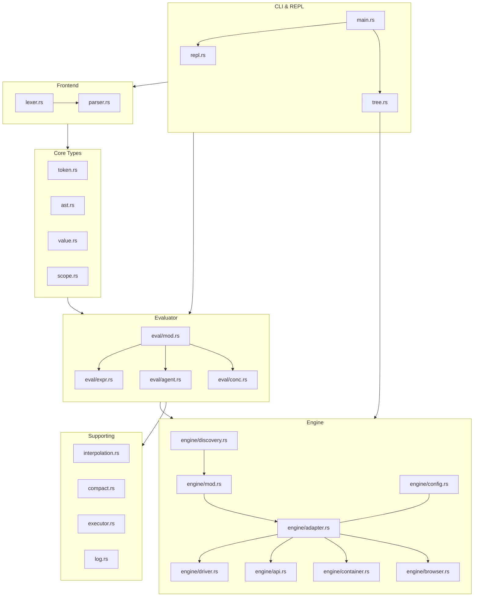
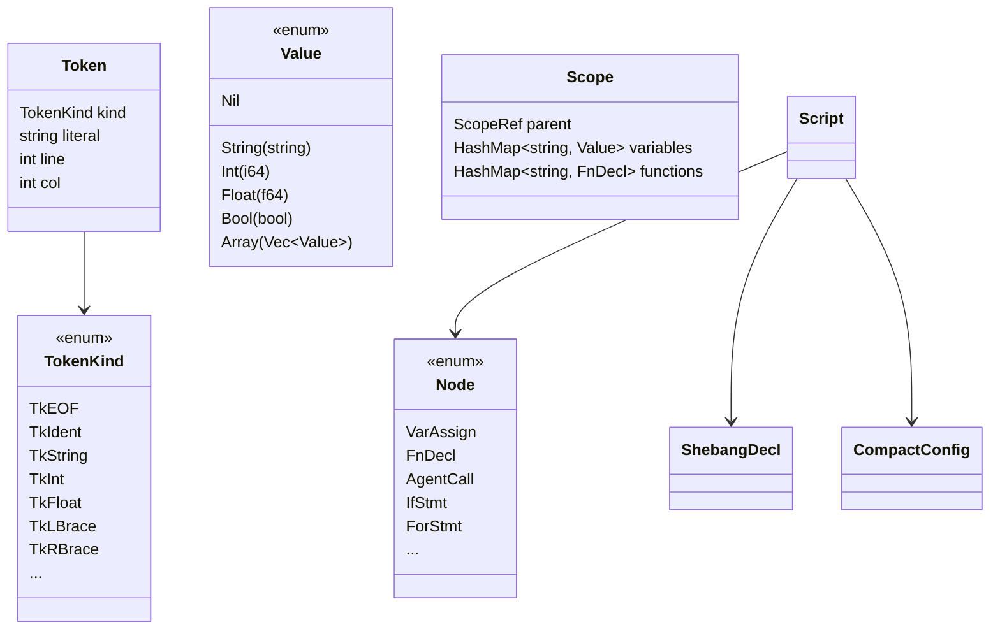
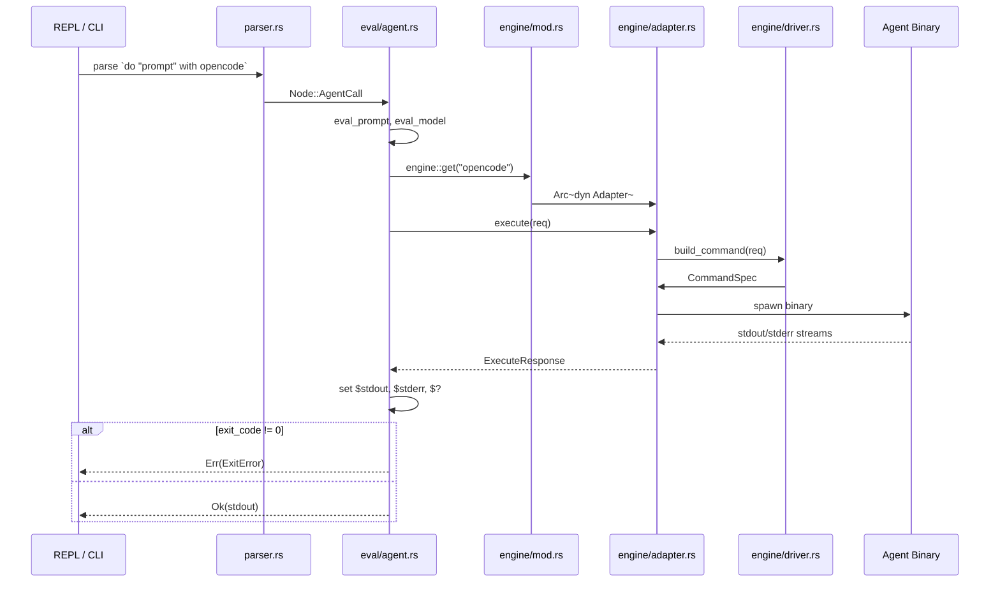
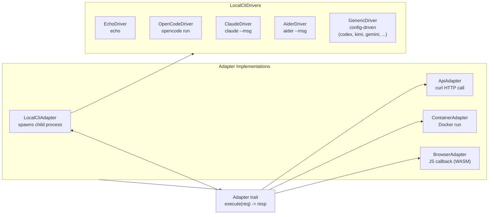
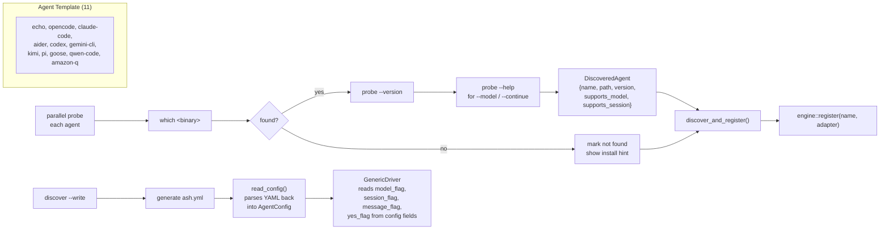
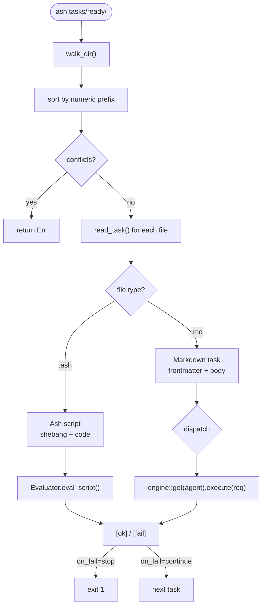
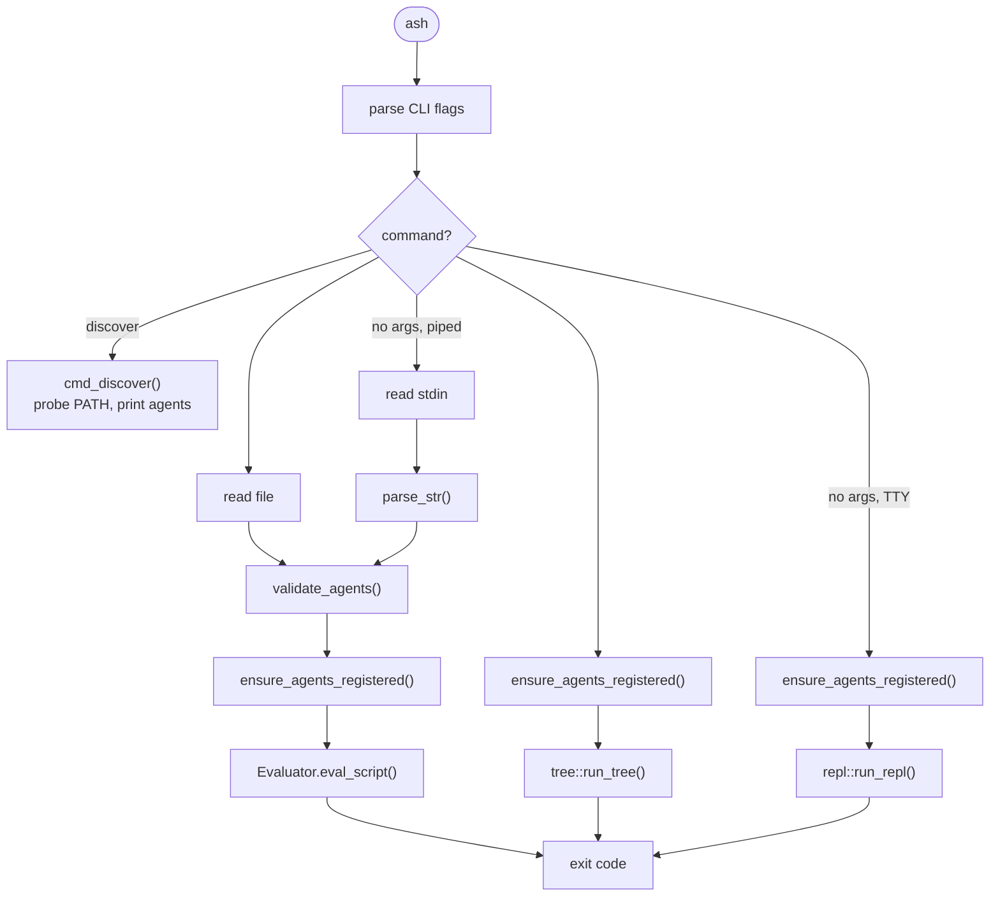

# Ash Architecture

Ash is a multi-agent orchestration shell — a scripting language and runtime for
delegating tasks to LLM-backed CLI agents (opencode, Claude Code, Aider) while
supporting standard programming constructs.

---

## Layer Overview



---

## 1. Core Data Types



### Token (`token.rs`)
The lexer output — `TokenKind` enum with 40 variants (TkIdent, TkString,
TkLBrace, etc.) + a `Token` struct carrying `kind`, `literal`, `line`, `col`.

### Value (`value.rs`)
The runtime value type — an enum:
- `String`, `Int`, `Float`, `Bool`, `Array(Vec<Value>)`, `Nil`
- Implements arithmetic (`+`, `-`, `*`, `/`, `%`), comparison (`==`, `!=`,
  `<`, `>`, `<=`, `>=`), truthiness, and `len()`.

### AST (`ast.rs`)
All parsed constructs are `Node` enum variants. Key groups:

| Group | Nodes |
|-------|-------|
| **Literals** | `StringLiteral`, `TextBlock`, `IntLiteral`, `FloatLiteral`, `BoolLiteral`, `ArrayLiteral` |
| **Refs** | `VarRef`, `IndexExpr`, `FilePath`, `CommandSubst`, `GroupExpr` |
| **Ops** | `BinaryExpr`, `UnaryExpr` |
| **Control flow** | `IfStmt`, `ForStmt`, `WhileStmt`, `Return`, `Break`, `Continue` |
| **Functions** | `FnDecl`, `FnCall` |
| **IO** | `Print`, `Exec`, `Exit`, `Env`, `Include` |
| **Agent** | `AgentCall` (the `do` keyword) |
| **Try/retry** | `BinaryTry`, `EvalTry` |
| **Concurrency** | `WaitBlock`, `Background` |
| **Scoping** | `Block`, `DirBlock`, `SessionBlock`, `SessionToggle`, `WithinToggle` |
| **Meta** | `VarAssign`, `CompactStmt` |
| **Script** | `Script` (top-level: shebang + compact config + body) |

### Scope (`scope.rs`)
Lexically-scoped variable store with parent chaining:
- `ScopeRef = Arc<Mutex<Scope>>` for thread-safe shared access
- `variables` (HashMap) and `functions` (HashMap)
- `get()` walks up the parent chain; `set()` writes to nearest scope;
  `set_local()` writes only to current scope
- Initial variables: `?` (exit code, 0), `stdout` (""), `stderr` ("")

---

## 2. Frontend: Lexer → Parser

### Lexer (`lexer.rs:1-509`)
Char-by-char streaming tokenizer. Produces `Vec<Token>` from source text:
- Tracks `start_of_line` for shebang (`#!`) detection
- Single-pass with no backtracking
- `read_string()` handles escape sequences (`\"`, `\$`, `\\`, `\n`, `\t`)
- `read_dollar()` handles `${var}`, `$(cmd)`, `$?`, `$NAME`
- Triple-backtick text blocks (` ``` `)
- Collapses consecutive newlines

Also exports shebang parsing (`parse_shebang`, `lexer.rs:523-537`) and compact
config line parsing (`parse_compact_line`, `lexer.rs:539-563`).

### Parser (`parser.rs`)
Recursive-descent parser consuming the token stream:
- `parse()` → `Script` (shebang + compact config + body of statements)
- `parse_statement()` dispatches on keyword identifiers:
  - Keywords: `do`, `if`, `for`, `while`, `fn`, `try`, `within`, `wait`,
    `exec`, `print`, `exit`, `env`, `include`, `compact`, `session`,
    `return`, `break`, `continue`
  - Bare identifiers become `VarAssign` (if followed by `=`) or `FnCall`
    (if followed by `(`) or `VarRef`
- `parse_do()` (`parser.rs:381-454`) creates `AgentCall` with optional
  `with <agent>`, `using <model>`, `in <dir>`, `compact <strategy>` clauses
- Expression parsing via `parse_binary_expr()` with operator precedence:
  `or` (1) < `and` (2) < comparisons (3) < `+`/`-` (4) < `*`/`/` (5)

---

## 3. Evaluator (`src/eval/`)

### Main Evaluator (`eval/mod.rs:75-500`)
The heart of the runtime. Holds:
- `current_scope` / `global_scope` — `ScopeRef` for variable storage
- `stdout` / `stderr` — `SharedWriter` (write targets, replacable for testing)
- `executor` — spawns shell commands for the `exec` keyword
- `compact_config` — per-script compact mode settings
- `default_agent` / `default_model` — set from shebang or CLI `--agent`
- `session_depth` — tracks nesting of `session begin`/`end`
- `within_stack` — tracks directory restoration for `within begin`/`end`
- `bg_handles` — join handles for `&`-backgrounded statements

Statement dispatch (`eval_statement`, line 136) routes each AST node to its
handler:

```mermaid
flowchart LR
    input["eval_statement(node)"] --> match{"node kind"}
    match -->|"Print &#124; Exit &#124; Exec &#124; Env"| io["eval_print / eval_exit / etc."]
    match -->|"IfStmt &#124; ForStmt &#124; WhileStmt"| flow["eval_if / eval_for / eval_while"]
    match -->|"FnDecl &#124; Return &#124; Break &#124; Continue"| fn_["eval_fn_decl / eval_return / etc."]
    match -->|"AgentCall"| agent["eval_agent_call"]
    match -->|"BinaryTry &#124; EvalTry"| try_["eval_binary_try / eval_eval_try"]
    match -->|"WaitBlock &#124; Background"| conc["eval_wait / eval_background"]
    match -->|"Include &#124; DirBlock"| include["eval_include / eval_dir_block"]
    match -->|"CompactStmt &#124; SessionBlock &#124; SessionToggle &#124; WithinToggle"| misc["compact / session / within"]
    match -->|"Block"| block["eval_block (scoped)"]
    match -->|"VarAssign &#124; BinaryExpr &#124; VarRef &#124; ..."| expr["eval_expr (expr.rs)"]
```



Expression evaluation is in `eval/expr.rs`.

### Expressions (`eval/expr.rs`)
Evaluates all expression nodes:
- Arithmetic (`+`, `-`, `*`, `/`, `%`), comparisons, boolean logic (`and`,
  `or`, `not`)
- String interpolation via `Interpolation::resolve_spans()`
- Variable assignment (`set` on nearest scope) and reference
- Function calls — first checks for builtins (`len`), then user-defined
  functions in scope
- Array indexing
- Command substitution (`$(...)` → runs via `executor`)

### Agent Calls (`eval/agent.rs:10-109`)



The `do` command handler:
1. Evaluates prompt, model, dir expressions
2. Builds `ExecuteRequest` with session flag
3. Looks up agent adapter from registry via `engine::get(agent_name)`
4. Falls back to spawning the agent binary directly if not in registry
5. Stores `stdout`, `stderr`, `?` in scope
6. Applies compact directive if specified
7. Returns `EvalError::Exit` if exit code is non-zero

Also contains `eval_binary_try()` and `eval_eval_try()` — retry/fallback
loops with accept/partial/fail routing.

### Concurrency (`eval/conc.rs`)
- `eval_background()` — spawns a thread for the statement, stores handle
- `eval_wait()` — joins all background threads + any explicitly waited
  block statements in parallel

---

## 4. Engine (`src/engine/`)

The engine abstracts agent invocation behind a common interface.

### Core Interface (`engine/adapter.rs`)
```rust
trait Adapter: Send + Sync {
    fn execute(&self, req: &ExecuteRequest) -> ExecuteResponse;
}
```
- `ExecuteRequest` — `{ prompt, model, dir, session }`
- `ExecuteResponse` — `{ stdout, stderr, exit_code }`

### Registry (`engine/mod.rs:22-33`)
Thread-safe global registry:
- `OnceLock<Mutex<HashMap<String, Arc<dyn Adapter>>>>`
- `register(name, adapter)`, `get(name)` → `Option<Arc<dyn Adapter>>`
- `register_defaults()` — registers built-in agents; `discover_and_register()` probes all 11 template agents in parallel

### Adapter Types



| Adapter | File | Mechanism |
|---------|------|-----------|
| `LocalCliAdapter` | `adapter.rs` | Spawns child process via `std::process::Command`, streams stdout/stderr in real-time threads |
| `ApiAdapter` | `api.rs` | Calls HTTP endpoint via `curl` with JSON body |
| `ContainerAdapter` | `container.rs` | Runs agent inside Docker container with stdin/stdout |
| `BrowserAdapter` | `browser.rs` | In-process JS callback (for WASM builds); `BrowserFallback` returns error on native |

### Drivers (`engine/driver.rs`)
`LocalCliAdapter` delegates command construction to a `LocalCliDriver`:

| Driver | Binary | Command pattern |
|--------|--------|----------------|
| `EchoDriver` | `echo` | `echo "<prompt>"` |
| `OpenCodeDriver` | `opencode` | `opencode run [--model M] [--continue] <prompt>` |
| `ClaudeDriver` | `claude` | `claude [--continue] [--model M] --msg <prompt>` |
| `AiderDriver` | `aider` | `aider [--yes] [--model M] [--restore-chat-history] --msg <prompt>` |
| `GenericDriver` | config-driven | `{args} [yes_flag] [model_flag M] [session_flag] [message_flag prompt]` |

### Config (`engine/config.rs`)
`AgentConfig` struct covers all adapter types with fields for type, driver,
command, API endpoint/auth, and container config.

### Discovery (`engine/discovery.rs`)



- Scans PATH for all 11 template agents in parallel (`which`, via threads + mpsc)
- Probes version (`--version`) and capabilities (`--help` for `--model`/`--continue` flags)
- Can generate `ash.yml` via `discover --write`
- `discover_and_register()` — discovers and registers found agents automatically
- `read_config()` — parses `ash.yml` back into `Vec<AgentConfig>` (supports both old `driver:` format and new structured fields)
- `GenericDriver` — reads all command construction from config fields (`cmd`, `args`, `model_flag`, `session_flag`, `message_flag`, `stdin_prompt`, `yes_flag`), enabling custom agents without Rust code

### Generic Driver (`engine/driver.rs`)

New agents can be added to `ash.yml` without writing Rust code:

```yaml
agents:
  # custom CLI agent — no recompile needed
  copilot:
    type: local-cli
    cmd: gh
    args: ["copilot", "suggest"]
    model_flag: "--model"
    message_flag: "--prompt"
    yes_flag: "--yes"
```

When `from_config()` encounters a `LocalCli` config with no known `driver:` field, it creates a `GenericDriver` that constructs the command line from the structured fields:

| Field | Purpose |
|-------|---------|
| `cmd` | Binary path |
| `args` | Static prefix arguments |
| `model_flag` | e.g. `--model` — passed with model value when non-empty |
| `session_flag` | e.g. `--continue` — passed when session mode is active |
| `message_flag` | e.g. `--msg` — passed before the prompt; without this, prompt is the last positional arg |
| `stdin_prompt` | When `true`, prompt is piped to stdin instead of CLI arg |
| `yes_flag` | e.g. `--yolo` — passed when auto-approve mode is active |

---

## 5. Tree Walker (`src/tree.rs`)



The directory-based orchestration engine (`ash <directory>`):
- `walk_dir()` — recursively scans a directory for numbered task files (`.md`
  and `.ash`), enforcing unique numeric prefixes and detecting conflicts
- Task files can be:
  - **Markdown** — prompt extracted from body text, with optional YAML
    frontmatter (`agent`, `model`, `compact`, `on_fail`)
  - **Ash** — executed as ash scripts, shebang determines agent
- `run_tree()` — walks the directory, then dispatches each task sequentially
  through the engine adapters or the ash evaluator
- Supports `--dry-run`, `--continue-on-error`, and `--check`

---

## 6. CLI & REPL (`src/main.rs`, `src/repl.rs`)

### CLI (`main.rs`)



- `ash <file.ash>` — parse and evaluate a script
- `ash <directory>` — walk and execute task tree
- `ash discover [--write]` — discover and optionally configure agents
- `ash` (no args, TTY) — interactive REPL
- Flags: `--check`, `--dry-run`, `--continue-on-error`, `--agent <spec>`

### Agent spec format
`<agent_name>[:<model>]` — e.g., `opencode:sonnet`, `echo`

### REPL (`repl.rs`)
- Uses `rustyline` for line editing (history, multi-line input)
- Multi-line continuation: braces auto-detect, `\` for manual continuation
- Dot commands: `.help`, `.clear`, `.vars`, `.exit`
- Expression results printed automatically (unless `nil`)
- Piped mode: reads from stdin when not a TTY

### Script validation (`main.rs:102-186`)
- `validate_agents()` — checks that all agents referenced in a script are
  either built-in or configured in `ash-project.yaml`

### Agent registration (`main.rs:230-238`)
- If `ash-project.yaml` exists → `read_config()` parses it → each agent
  registered via `from_config()` (supports both old `driver:` backward compat
  and new structured fields for custom agents)
- Otherwise → `discover_and_register()` (probes PATH, registers found agents
  with backward-compat configs)

---

## 7. Supporting Modules

### Interpolation (`interpolation.rs`)
Resolves `${var}` and `$(cmd)` syntax in strings using regex:
- `resolve()` — inline replacement on flat strings
- `resolve_spans()` — ordered replacement from pre-parsed AST interpolation spans
- Handles `\$` escape sequences

### Compact (`compact.rs`)
The "compact mode" system for controlling LLM context windowing:
- `Config` — carries `mode`, `window`, `strategy`
- `Directive::parse("truncate 32000")` → parses action + args
- Strategies: `on`, `off`, `auto`, `truncate`, `summarize`, `window`, `drop`
- Configurable per-script via `#!compact mode=on window=64000 strategy=truncate`
  and per-call via `do "prompt" compact "truncate 16000"`

### Executor (`executor.rs`)
- `Executor::run(cmd)` — runs a shell command via `bash -c <cmd>`
- Returns `ExecResult { stdout, stderr, exit_code }`
- Provides `quote()` for safe shell argument escaping

### Logger (`log.rs`)
Custom `log` crate implementation:
- Controlled by `ASH_LOG` env var (level: error/warn/info/debug/trace)
- Writes to file specified by `ASH_LOG_FILE` (default: `ash.log`)
- Custom timestamp formatting (no chrono dependency)

---

## 8. Compilation & Dependencies

- Single Rust crate: `Cargo.toml` with `name = "ash"`, edition 2021
- Dependencies: `regex = "1"`, `log = "0.4"`, `rustyline = "14"`
- Tested via `cargo test` (extensive unit tests in-line)
- Thread-safety: all long-lived types implement `Send` + `Sync` (verified
  via assertions in `lib.rs`)
