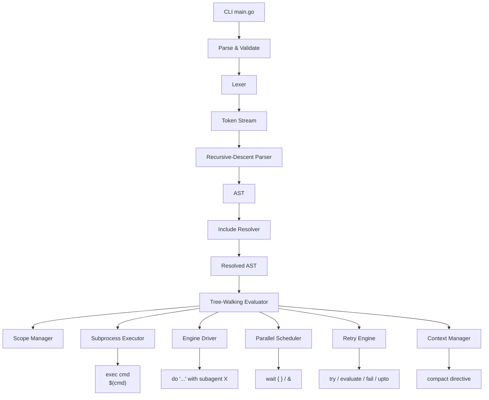
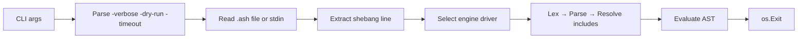
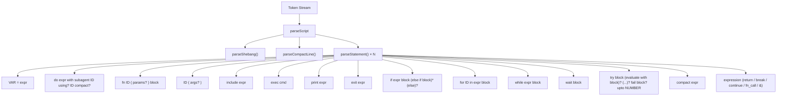
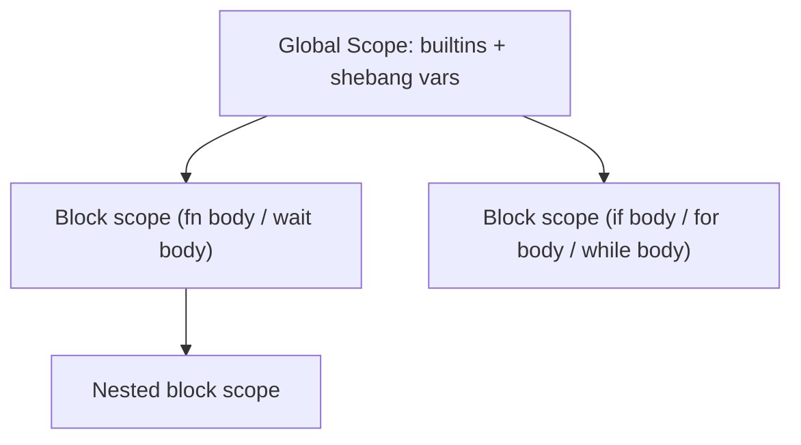
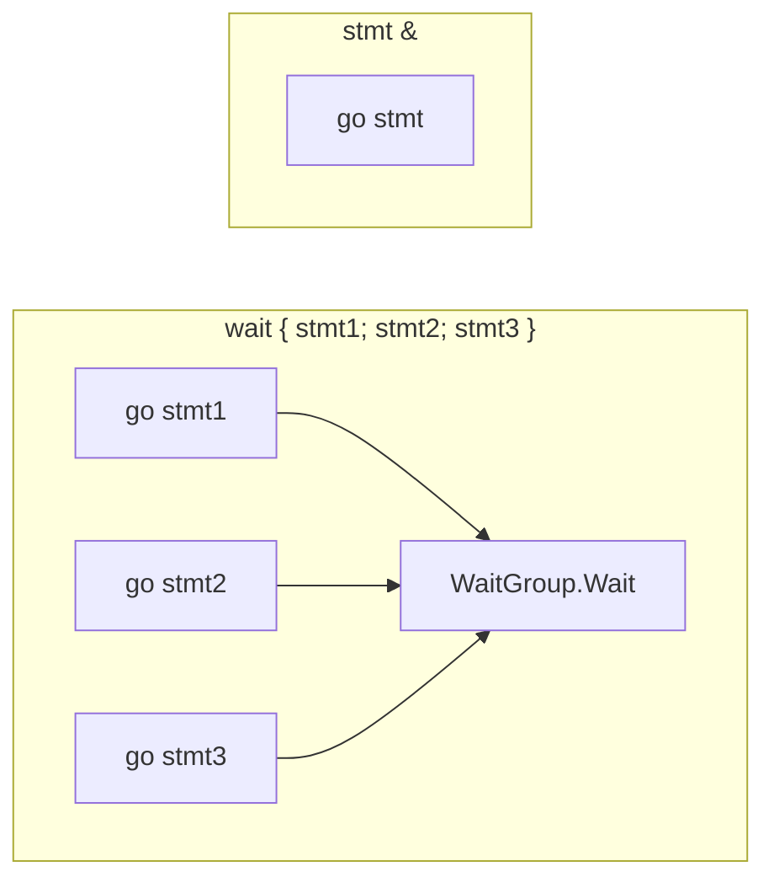
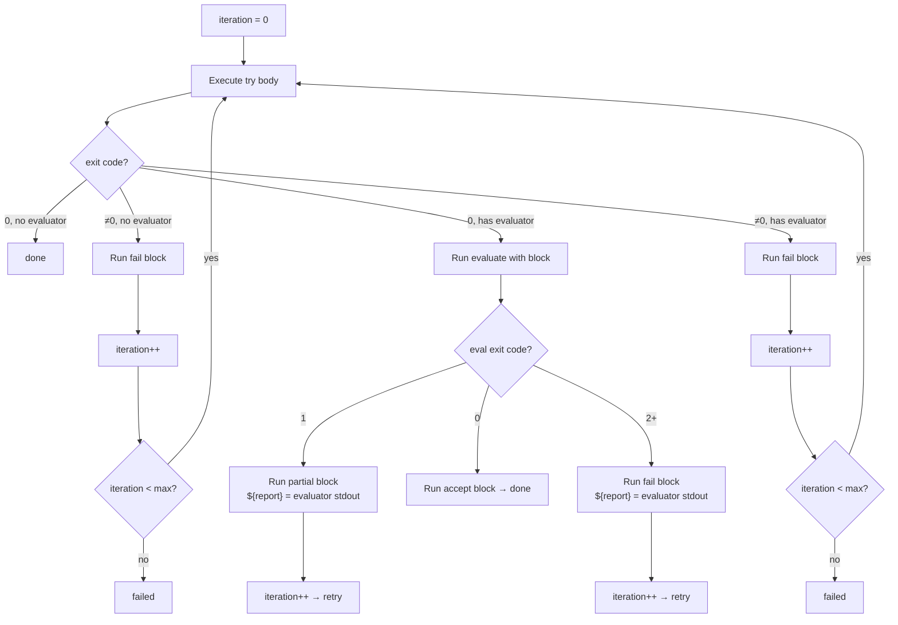
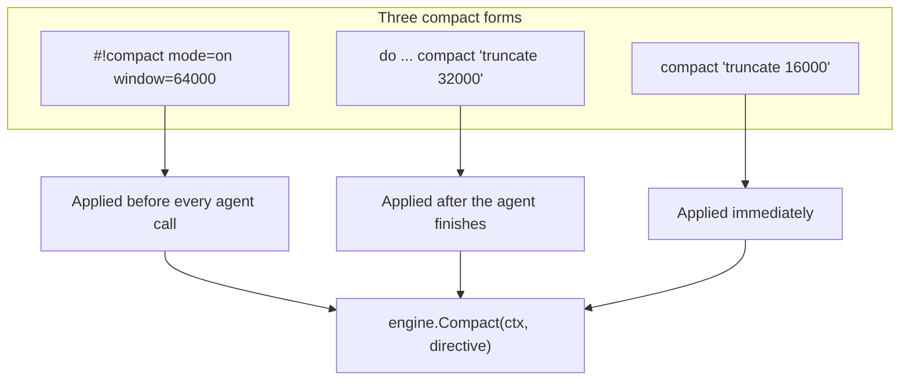
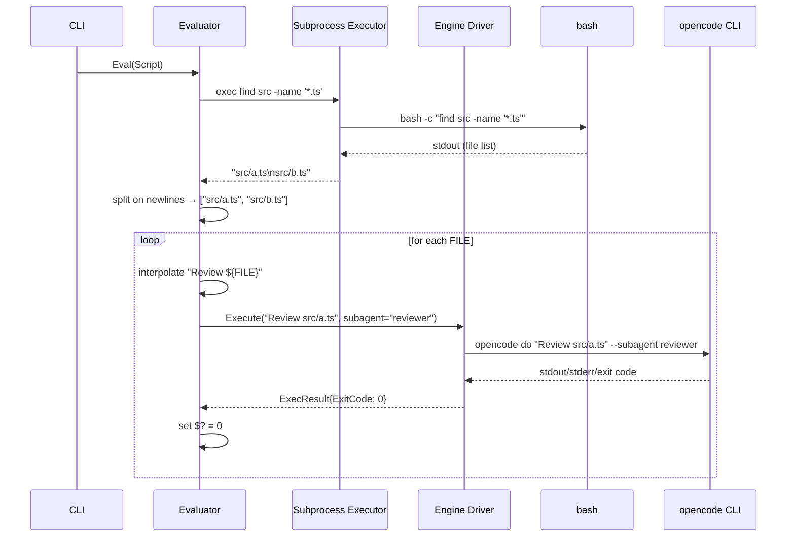
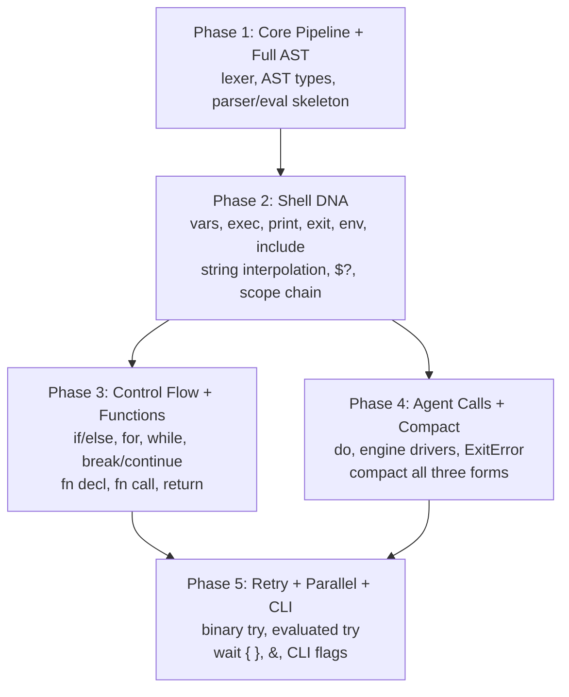

# Ash Execution Engine — High-Level Design

**Language:** Go  
**Target:** CLI binary (`ash`) that parses `.ash` scripts and orchestrates AI coding agents.

---

## 1. System Overview



The engine is a single-pass, tree-walking interpreter. It reads `.ash` source, resolves includes, then evaluates top-down. No compilation, no bytecode, no JIT.

---

## 2. Component Details

### 2.1 CLI Entry Point

**Package:** `cmd/ash/main.go`



**Flags:**

| Flag | Default | Description |
|------|---------|-------------|
| `-verbose` | `false` | Print each statement as it executes |
| `-dry-run` | `false` | Parse + validate, don't execute |
| `-timeout` | `0` (none) | Global execution timeout |

The CLI reads shebang `#!` to detect the target engine, instantiates the matching `EngineDriver`, then parses and runs the script.

### 2.2 Lexer

**Package:** `lexer/`

Hand-written, single-pass tokenizer. No regex — byte-by-byte scanning for predictable behavior and clear error reporting.

```mermaid
flowchart TD
    Source[source bytes] --> Scan[scan loop]
    Scan -->|letter| Ident[identifier / keyword]
    Scan -->|digit| Number[integer / float]
    Scan -->|`"`| String[double-quoted string]
    Scan -->|backtick| TextBlock[triple-backtick block]
    Scan -->|`$`| VarRef[variable reference]
    Scan -->|`#`| Comment[line comment]
    Scan -->|`#!`| Shebang[shebang line]
    Scan -->|`=` `==` etc| Operator[operator tokens]
    Scan -->|whitespace| NL[significant newlines]
    Scan -->|other| Delim[delimiters]
```

**Token types:**

| Category | Tokens |
|----------|--------|
| Keywords | `if`, `else`, `for`, `while`, `fn`, `return`, `do`, `with`, `subagent`, `using`, `try`, `fail`, `evaluate`, `accept`, `partial`, `upto`, `wait`, `compact`, `include`, `exec`, `print`, `exit`, `env`, `break`, `continue`, `not`, `and`, `or` |
| Operators | `==`, `!=`, `>=`, `<=`, `>`, `<`, `+`, `-`, `*`, `/`, `=` |
| Special | `(`, `)`, `{`, `}`, `,`, `&`, `@`, `$`, `${`, `$(` |
| Literals | string, text-block, integer, float |
| Meta | EOF, Newline |

**String handling:** The lexer produces raw string tokens. Interpolation (`${}` and `$(cmd)`) is resolved at eval time, not parse time. The lexer emits a composite token type for strings containing interpolation points.

**Text blocks:** Delimited by `` ``` ``. Contents are captured verbatim (no escape processing). Interpolation markers are flagged for eval-time resolution.

### 2.3 Parser

**Package:** `parser/`

Recursive-descent parser. Each grammar rule is one function, returning an AST node. Newlines are significant — `if`, `else`, `else if`, `for`, `while`, `try`, `fn`, and `wait` all require body braces on a **new line** after the header.



**Grammar (informal):**

```
script          = shebang? compact_line? statement*

shebang         = "#!" IDENT ":" VERSION (":" IDENT)?
compact_line    = "#!compact" (IDENT "=" VALUE)*

statement       = var_assign
                | do_stmt
                | fn_decl
                | fn_call
                | include_stmt
                | exec_stmt
                | print_stmt
                | exit_stmt
                | if_stmt
                | for_stmt
                | while_stmt
                | wait_stmt
                | try_stmt
                | compact_stmt
                | return_stmt
                | break_stmt
                | continue_stmt
                | expr_stmt "&"?

var_assign      = IDENT "=" expression
do_stmt         = "do" expression "with" "subagent" IDENT
                  ("using" expression)? ("compact" expression)?
fn_decl         = "fn" IDENT "(" [IDENT ("," IDENT)*] ")" block
fn_call         = IDENT "(" [expression ("," expression)*] ")"
include_stmt    = "include" expression
exec_stmt       = "exec" expression
print_stmt      = "print" expression
exit_stmt       = "exit" expression

if_stmt         = "if" expression NL block
                  ("else if" expression NL block)*
                  ("else" NL block)?
for_stmt        = "for" IDENT "in" expression block
while_stmt      = "while" expression block
wait_stmt       = "wait" block

try_stmt        = "try" block
                  ("evaluate" "with" block)?
                  ("accept" block)?
                  ("partial" block)?
                  ("fail" block)?
                  "upto" NUMBER

compact_stmt    = "compact" expression
return_stmt     = "return" [expression]
break_stmt      = "break"
continue_stmt   = "continue"
expr_stmt       = expression

block           = "{" NL? statement* "}"
```

**Error recovery:** The parser stops at the first error and reports the line + expected tokens. No error recovery — the language is small enough that single-error-at-a-time is fine.

### 2.4 AST

**Package:** `ast/`

```go
// Node is the interface satisfied by all AST nodes.
type Node interface {
    Pos() Pos
}

type Pos struct { Line, Col int }

// Top level
type Script struct {
    Shebang    *ShebangDecl
    Compact    *CompactConfig
    Statements []Node
}

type ShebangDecl struct {
    Engine  string
    Version string
    Model   string // empty if not specified
}

type CompactConfig struct {
    Mode     string
    Window   string
    Strategy string
}

// --- Statements ---
type VarAssign struct   { Name string; Value Node }
type AgentCall struct   { Prompt Node; Subagent string; Model *Node; Compact *Node }
type FnDecl struct      { Name string; Params []string; Body *Block }
type FnCall struct      { Name string; Args []Node }
type Include struct     { Path Node }
type Exec struct        { Cmd Node }
type Print struct       { Message Node }
type Exit struct        { Code Node }
type Env struct         { Key string }
type IfStmt struct      { Cond Node; Body *Block; ElseIfs []ElseIf; Else *Block }
type ElseIf struct      { Cond Node; Body *Block }
type ForStmt struct     { Var string; List Node; Body *Block }
type WhileStmt struct   { Cond Node; Body *Block }
type WaitBlock struct   { Body *Block }
type Background struct  { Stmt Node }
type CompactStmt struct { Arg Node }
type Return struct      { Value Node }
type Break struct       {}
type Continue struct    {}

type BinaryTry struct {
    Body *Block
    Fail *Block
    Max  int
}

type EvalTry struct {
    Body    *Block
    Eval    *Block
    Accept  *Block
    Partial *Block
    Fail    *Block
    Max     int
}

type Block struct {
    Statements []Node
}

// --- Expressions ---
type BinaryExpr struct  { Left, Right Node; Op TokenKind }
type UnaryExpr struct   { Op TokenKind; Right Node }
type VarRef struct      { Name string }
type StringLiteral struct { Value string }
type TextBlock struct   { Value string }
type FilePath struct    { Path Node }    // @path.md agent prompts
type IntLiteral struct  { Value int64 }
type FloatLiteral struct{ Value float64 }
type BoolLiteral struct { Value bool }
type CommandSubst struct{ Cmd string }  // $(cmd) inline
type GroupExpr struct   { Inner Node }
```

### 2.5 Evaluator

**Package:** `eval/`

Tree-walking interpreter. Walks the AST top-down, maintaining a scope stack and side-effect state (`$?`, `${stderr}`, `${stdout}`, `${report}`).

```mermaid
flowchart TD
    Eval["Eval(node)"] --> SWITCH{node type}
    SWITCH -->|Script| EvalScript["eval each statement in order"]
    SWITCH -->|VarAssign| EvalAssign["evaluate RHS → store in scope"]
    SWITCH -->|AgentCall| DoAgent["delegate to EngineDriver.Execute()"]
    SWITCH -->|FnCall| Call["push scope → bind args → eval body → pop → return"]
    SWITCH -->|Exec| DoExec["shell out via os/exec → set $?"]
    SWITCH -->|Include| DoInclude["read file → lex → parse → eval in current scope"]
    SWITCH -->|IfStmt| DoIf["evaluate cond → execute matching branch"]
    SWITCH -->|ForStmt| DoFor["split list → iterate → set loop var → eval body"]
    SWITCH -->|WhileStmt| DoWhile["eval cond → body → repeat"]
    SWITCH -->|WaitBlock| DoWait["spawn goroutine per stmt → WaitGroup.Wait"]
    SWITCH -->|Background| DoBg["go func() { eval stmt } → return"]
    SWITCH -->|BinaryTry| DoRetry["retry.Body() → exit ≠ 0 → retry.Fail() → repeat up to N"]
    SWITCH -->|EvalTry| DoEvalRetry["retry.Body() → Eval() → exit codes route to Accept/Partial/Fail"]
    SWITCH -->|CompactStmt| DoCompact["delegate to engine's compact command"]
    SWITCH -->|Return| DoReturn["set $? + value → signal return to enclosing fn"]
    SWITCH -->|Break/Continue| DoFlow["signal to enclosing loop"]
```



**Scope model:**



- **Global scope:** Built-in functions (`print`, `exit`, `env`, `compact`), runtime variables (`$?`, `${stderr}`, `${stdout}`, `${report}`).
- **Script scope:** Variables assigned at the top level of a `.ash` file.
- **Block scope:** Created by each `{ }` body (functions, if/for/while, wait, try blocks).
- **Read semantics:** Walks up the scope chain until variable is found.
- **Write semantics:** Writes to the innermost scope where the variable exists, or the current scope if not found.
- **Functions:** Parameters are local to the function scope. Outer variables are readable but not writable (new var with same name shadows the outer).

**Value types:** `interface{}` — stores `string`, `int64`, `float64`, `bool`, `nil`, `[]Value` (arrays). Dynamically typed (ash has no type declarations).

**Expression evaluation:**

| Expression | Behavior |
|------------|----------|
| `VarRef` | Lookup variable in scope chain |
| `StringLiteral` | Interpolate `${VAR}` and `$(cmd)` inline, return string |
| `TextBlock` | Same interpolation as strings |
| `CommandSubst` | Run `sh -c "cmd"`, capture stdout, return as string |
| `IntLiteral` / `FloatLiteral` | Return as numeric value |
| `BinaryExpr` | Type-dependent: `+ - * /` for numbers, `== != > < >= <=` for comparison, `and or` for logic |
| `UnaryExpr` | `not` for boolean negation, `-` for numeric negation |
| `GroupExpr` | Evaluate inner expression |

### 2.6 Engine Driver

**Package:** `engine/`

Abstracts over different AI coding agent CLIs. Each engine is a struct implementing `Driver`.

```go
type Driver interface {
    Name() string
    Version() (string, error)
    Execute(ctx context.Context, opts ExecOpts) (ExecResult, error)
    Compact(ctx context.Context, directive string) error
}

type ExecOpts struct {
    Prompt      string
    Model       string     // optional model override
    Compact     string     // per-agent compact directive
    CompactCfg  *CompactConfig  // global compact defaults
}

type ExecResult struct {
    Stdout   string
    Stderr   string
    ExitCode int
}
```

**Implementations:**

| Shebang `#!` | Engine | Binary | Install | Runtime |
|--------------|--------|--------|----------|---------|
| `opencode` | [OpenCode](https://opencode.ai) | `opencode` | `brew install opencode` | Go (single binary) |
| `claude-code` | [Claude Code](https://claude.com/product/claude-code) | `claude` | `npm -g @anthropic-ai/claude-code` | Node.js 18+ |
| `codex` | [OpenAI Codex CLI](https://developers.openai.com/codex/cli/) | `codex` | `npm -g @openai/codex` | Node.js 18+ |
| `gemini` | [Gemini CLI](https://geminicli.com/) | `gemini` | `npm -g @google/gemini-cli` | Node.js 18+ |
| `copilot` | [GitHub Copilot CLI](https://github.com/features/copilot/cli) | `copilot` | `npm -g @github/copilot` | Node.js 18+ |
| `aider` | [Aider](https://aider.chat) | `aider` | `pip install aider-chat` | Python 3.9+ |

Each engine resolves the binary from `$PATH`, constructs the CLI invocation, passes the prompt (via stdin or argument depending on engine conventions), captures stdout/stderr, and returns the exit code.

**Initial implementation priority:** OpenCode (same language, Go → single-binary integration possible), Claude Code (most mature CLI agent), Codex CLI (OpenAI ecosystem). Remaining engines added post-v1.

### Engine-specific invocation

Each engine has a different CLI surface. The driver adapts ash concepts to the engine's native interface:

#### OpenCode

```bash
opencode do "<prompt>"                    # do with default subagent
opencode do "<prompt>" --model <model>    # using <model>
```

- **Subagent:** Handled natively — OpenCode's `subagent` concept maps 1:1 to ash's `subagent` clause. The driver passes `--subagent <name>` to the opencode CLI.
- **Compact:** OpenCode has compact support. Driver translates ash `compact "..."` to opencode's compact flags or prompts.
- **Version check:** `opencode --version` — parse semantic version, match against shebang constraint.
- **Advantage:** Same language (Go) as ash engine — potential for library-level integration instead of CLI subprocess in the future.

#### Claude Code

```bash
claude -p "<prompt>"                       # -p for non-interactive (print mode)
claude -p "<prompt>" --model <model>
```

- **Subagent:** Claude Code supports sub-agents via its `Task(...)` tool internally. The driver passes instructions through the prompt — no separate `--subagent` flag. Ash's `subagent` name becomes a directive embedded in the prompt text.
- **Compact:** Claude Code manages context via its `/compact` slash command. In non-interactive mode, driver appends compact instructions to the prompt or uses CLAUDE.md configuration.
- **Version check:** `claude --version` — parse output, match against shebang.
- **Advantage:** Most mature CLI agent with explicit control primitives. MCP integration for extending agent capabilities.

#### OpenAI Codex CLI

```bash
codex "<prompt>"
codex "<prompt>" --model <model>
```

- **Subagent:** Codex does not have explicit subagent primitives. Driver embeds subagent role description into the prompt prefix: `"You are a <subagent-name>. " + prompt`.
- **Compact:** `/model` command switches models. Not a compact tool per se. Driver manages context limits by chunking or summarizing.
- **Version check:** `codex --version`. Match against shebang.
- **Advantage:** Native OpenAI ecosystem integration. Sandboxed execution environment.

#### Gemini CLI

```bash
gemini "<prompt>" --model <model>
gemini --context-window 1000000 "<prompt>"
```

- **Subagent:** No native subagent support. Driver prefixes prompt with role description.
- **Compact:** 1M token context window is the largest among CLI agents. Compact is less critical but driver can use `--context-window` flag to manage limits.
- **Version check:** `gemini --version`.
- **Advantage:** Massive context window — analyze entire codebases in a single prompt.

#### GitHub Copilot CLI

```bash
copilot "<prompt>"
copilot "<prompt>" --model <model>
```

- **Subagent:** No native subagent primitives. Driver embeds subagent role via prompt prefix.
- **Compact:** No explicit compact tool. Driver manages via prompt engineering.
- **Version check:** `copilot --version`.
- **Advantage:** Zero additional procurement for teams with existing Copilot licenses. Multi-model backend.

#### Aider

```bash
aider --message "<prompt>" --model <model>
aider --subtask "<prompt>"                # sub-agent support
```

- **Subagent:** Aider supports subtasks via `--subtask-prompt`. Maps to ash's `subagent` concept with role description.
- **Compact:** Aider manages its own context window via repository mapping (Tree-sitter dependency graph). No explicit compact tool — driver relies on Aider's internal context management.
- **Version check:** `aider --version`.
- **Advantage:** Provider-agnostic (OpenAI, Anthropic, Google, local models). Git-native — auto-commits after each change. Self-hosting possible.

**Version check:** On startup, the engine queries its own version and asserts it matches the shebang. Mismatch = fatal error.

### 2.7 Subprocess Executor

**Package:** `executor/`

Handles `exec cmd` (statement level) and `$(cmd)` (inline substitution).

```go
type Executor struct {
    Timeout time.Duration
}

func (e *Executor) Run(ctx context.Context, cmd string) (ExecResult, error)
```

- Shells out via `bash -c "<cmd>"` on Unix, `cmd /c` on Windows.
- Captures stdout, stderr, and exit code.
- `exec cmd` at statement level: stdout is returned as a string value, `$?` is set.
- `$(cmd)` inline: stdout is substituted directly into the enclosing string.

### 2.8 Parallel Scheduler

**Package:** `sched/`

Implements `wait { }` and `&` concurrency primitives.



**Core types:**

```go
type Task func() (ExecResult, error)

type Scheduler struct {
    wg       sync.WaitGroup
    mu       sync.Mutex
    firstErr error
}

// RunAll executes all tasks concurrently, waits for all.
func (s *Scheduler) RunAll(ctx context.Context, tasks []Task) error

// Go launches a task in the background (fire-and-forget).
func (s *Scheduler) Go(task Task)
```

- `RunAll` uses `sync.WaitGroup`. Each task runs in its own goroutine.
- Fail-fast: if any goroutine returns a non-zero exit code, the context is cancelled for remaining tasks.
- `Go` launches a goroutine and returns immediately. No error tracking.
- Variables written inside `wait { }` are **not** shared — each goroutine operates on its own scope to avoid data races.

### 2.9 Retry Engine

**Package:** `retry/`

Handles both binary retry (`try/fail`) and evaluated retry (`try/evaluate/accept/partial/fail`).



**Binary retry pseudocode:**

```go
func (r *BinaryRetry) Run(ctx context.Context) error {
    for i := 0; i < r.Max; i++ {
        result := r.evalBody(ctx)
        if result.ExitCode == 0 {
            return nil
        }
        if i < r.Max-1 {
            r.setRuntimeVars(result) // $?, ${stderr}, ${stdout}
            r.evalFailBlock(ctx)
        }
    }
    return errors.New("retry exhausted")
}
```

**Evaluated retry pseudocode:**

```go
func (r *EvalRetry) Run(ctx context.Context) error {
    for i := 0; i < r.Max; i++ {
        bodyResult := r.evalBody(ctx)
        if bodyResult.ExitCode != 0 {
            // agent failed → skip evaluator → go to fail
            if r.Fail != nil {
                r.setReport("")
                r.evalFailBlock(ctx)
            }
            continue
        }
        evalResult := r.evalEval(ctx)
        r.setReport(evalResult.Stdout)
        switch evalResult.ExitCode {
        case 0:
            if r.Accept != nil { r.evalAcceptBlock(ctx) }
            return nil
        case 1:
            if r.Partial != nil { r.evalPartialBlock(ctx) }
            // fall through to retry
        default:
            if r.Fail != nil { r.evalFailBlock(ctx) }
            // fall through to retry
        }
    }
    return errors.New("retry exhausted")
}
```

### 2.10 Context Manager

**Package:** `compact/`

Thin adapter that delegates to the engine's native compact command.



Each engine implements compact differently:
- OpenCode: `opencode compact --mode on --window 64000`
- Claude Code: internally manages context; compact might be a no-op or a prompt injection
- Copilot: might not support compact at all

The engine driver's `Compact()` method handles the translation.

### 2.11 Built-in Functions

**Package:** `eval/builtins.go`

Registered in the global scope at startup.

| Function | Signature | Behavior |
|----------|-----------|----------|
| `print` | `print msg` | Write message to stdout. Sets `$?` = 0. |
| `exit` | `exit code` | Terminate script with exit code. |
| `env` | `env KEY` | Read environment variable, returns its value. |
| `compact` | `compact directive` | Delegate to engine's compact command. |

`include` and `exec` are handled as statement types at the parser level, not as built-in functions, since they need special evaluation logic (include = parse sub-file inline, exec = shell out).

---

## 3. Execution Walkthrough

Consider this ash script:

```ash
#!opencode:1.2.0

for FILE in exec find src -name '*.ts' {
    do "Review ${FILE}" with subagent reviewer
}
```



---

## 4. Error Handling

```mermaid
flowchart TD
    Error{error type} -->|LexerError| Stop1[print line:col → os.Exit 2]
    Error -->|ParseError| Stop2[print line:col + expected → os.Exit 2]
    Error -->|RuntimeError| Stop3[print message + source location → os.Exit 3]
    Error -->|ExitError| SetRuntime[set $? + ${stderr} + ${stdout}]
    SetRuntime --> InTry{inside try block?}
    InTry -->|yes| FailBlock["route to fail block"]
    InTry -->|no| Propagate[propagate as error]
```

**ExitError:** A special type that carries exit code, stdout, and stderr. The evaluator converts any non-zero subprocess result (from `exec` or `do`) into an `ExitError`. Inside `try { }`, this triggers the `fail` block instead of propagating. Outside of `try`, it propagates as a regular runtime error.

**Flow signals:** `Return`, `Break`, and `Continue` use a sentinel type internally — not panics. The evaluator checks for the sentinel after each statement evaluation and unwinds accordingly.

```go
type flowSignal struct {
    kind flowKind // return, break, continue
    value Value
}
```

---

## 5. Integration Points

The ash engine is purely an orchestrator — it delegates all heavy lifting to external processes:

| Responsibility | Delegates to |
|----------------|-------------|
| AI code generation / review | The target agent CLI (opencode, claude-code, copilot) |
| Shell commands (`exec`, `$(cmd)`) | `bash` (or `cmd.exe` on Windows) |
| Context compacting | The agent's native compact command |
| Quality evaluation (`evaluate with`) | Another agent call (typically a checker subagent) |

The engine does **not**:
- Execute code modifications itself
- Manage git branches or commits
- Have any AI/LLM capability
- Parse or understand programming languages
- Validate the quality of generated code

It only orchestrates — parsing the script, spawning the right subprocesses at the right time, and routing control flow based on exit codes.

---

## 6. Package Layout

```
ash/
├── cmd/ash/main.go          # CLI entry point
├── lexer/
│   ├── lexer.go             # Tokenizer
│   └── token.go             # Token types + TokenKind enum
├── parser/
│   └── parser.go            # Recursive descent parser
├── ast/
│   └── ast.go               # All AST node types
├── eval/
│   ├── evaluator.go         # Tree-walking interpreter
│   ├── scope.go             # Scope chain
│   ├── builtins.go          # print, exit, env
│   └── signals.go           # flowSignal, ExitError
├── engine/
│   ├── driver.go            # Driver interface + ExecOpts/ExecResult
│   ├── opencode.go          # OpenCode adapter
│   ├── claude.go            # Claude Code adapter
│   ├── codex.go             # OpenAI Codex CLI adapter
│   ├── gemini.go            # Gemini CLI adapter
│   ├── copilot.go           # GitHub Copilot CLI adapter
│   └── aider.go             # Aider adapter
├── executor/
│   └── executor.go          # Shell command runner (exec + $(cmd))
├── sched/
│   └── sched.go             # Parallel scheduler (wait { } + &)
├── retry/
│   └── retry.go             # Binary + evaluated retry
├── compact/
│   └── compact.go           # Context compacting adapter
├── high-level-design.md     # This file
└── go.mod
```

---

## 7. Key Design Decisions

| Decision | Choice | Rationale |
|----------|--------|-----------|
| Parser technique | Recursive descent | Simple, predictable, easy to hand-write. No parser generator dependency. |
| Interpreter style | Tree-walking | Ash is a scripting/shell language. No need for bytecode or JIT overhead. |
| Scope model | Lexical, values captured at write | Variables created inside `{}` are local; outer vars read-only in functions. Matches shell expectations. |
| Error propagation | Go error returns + sentinel flow signals | Avoids `panic/recover`. Signals for return/break/continue; ExitError for subprocess failures. |
| Engine abstraction | Interface per agent CLI | Each engine has different invocation syntax. Interface makes mocking trivial for tests. |
| Concurrency | `sync.WaitGroup` + goroutines | Go's built-in model maps 1:1 to `wait { }` semantics. No external async framework needed. |
| Compact | Engine-specific shell command | Each agent has its own compact mechanism. We delegate rather than reimplement. |
| Value types | Go `interface{}` | Ash is dynamically typed. Values are strings, numbers, bools, or nil. |
| Include resolution | Parse-time | Includes are lexed, parsed, and merged into the AST before evaluation. Makes scope handling predictable. |
| File size target | ~300 lines per file | Keeps AI-generated code reliable. Each file has a single clear responsibility. |

---

## 8. Testing Strategy

| Level | What | How |
|-------|------|-----|
| **Lexer** | Token correctness | Table-driven: `input → expected tokens`. Test edge cases (escapes, text blocks, shebangs). |
| **Parser** | AST correctness | Table-driven: `input → expected AST`. Test all grammar productions in isolation then combined. |
| **Evaluator** | Language semantics | Mock engine driver + executor. Test every control flow construct, scoping rules, retry logic. |
| **Retry engine** | Binary + evaluated | Mock the body/eval/fail blocks. Assert iteration count, exit routing, `${report}` values. |
| **Integration** | Full scripts | `.ash` test fixtures run against mock engine. Assert stdout, exit code, side-effect order. |
| **Snapshot** | Example script | Run the complete example from ash.md, capture output, compare on changes. |

The engine driver is always mocked in tests — no real AI agent needed. The executor is mocked for `exec cmd` tests (but real `os/exec` for integration). The retry engine is tested in isolation with function pointers.

---

## 9. Top-Level Interaction Flow

```mermaid
sequenceDiagram
    participant User
    participant CLI
    participant Parser
    participant Eval as Evaluator
    participant Scope
    participant Exec as Executor
    participant Engine as Engine Driver
    participant Sched as Scheduler
    participant Retry as Retry Engine

    User->>CLI: ash task.ash
    CLI->>Parser: lex + parse
    Parser-->>CLI: AST
    CLI->>Eval: Eval(script)

    Note over Eval,Retry: For each statement in order...

    Eval->>Exec: exec npm test
    Exec-->>Eval: stdout, $?=0

    Eval->>Scope: set $? = 0

    Eval->>Sched: "wait { do A; do B; do C }"
    Sched->>Engine: Execute(A) in goroutine 1
    Sched->>Engine: Execute(B) in goroutine 2
    Sched->>Engine: Execute(C) in goroutine 3
    Engine-->>Sched: results
    Sched-->>Eval: done

    Eval->>Retry: "try { do Fix bugs } fail untagged  upto 3"
    Retry->>Engine: Execute("Fix bugs")
    Engine-->>Retry: exit ≠ 0
    Retry->>Eval: eval fail block
    Retry->>Engine: Execute("Fix bugs" with stderr context)
    Engine-->>Retry: exit = 0
    Retry-->>Eval: success

    Eval-->>CLI: done
    CLI-->>User: exit 0
```

---

## 10. Implementation Plan

### 10.1 Rework-minimizing strategy

Three struct-level design rules prevent any phase from modifying code from a prior phase:

**Rule 1 — Define all AST node types in Phase 1.** Every node type the language will ever need (`FnDecl`, `BinaryTry`, `EvalTry`, `WaitBlock`, etc.) is a Go struct in `ast/ast.go` with zero implementation beyond `Pos()`. Adding a feature later means adding a `case` branch in the evaluator and a `parseXxx` function in the parser — never modifying an existing struct.

**Rule 2 — Keyword table is exhaustive from Phase 1.** The lexer's keyword map includes every reserved word across all phases. This prevents "promote identifier to keyword" changes that would break tokenization. Unknown keywords in an earlier phase simply never match in the parser's switch — they're inert until their phase arrives.

**Rule 3 — Parser and evaluator use switch dispatch with one case per statement type.** Every phase adds new `case` arms to exactly two switches (`parseStatement` and `evalStatement`). Adding a feature is strictly adding lines; no existing branches are touched.

Example of how each phase extends the parser (all phases shown at once):

```go
func (p *Parser) parseStatement() ast.Node {
    switch p.current.Kind {
    // ── Phase 1: skeleton only (all keywords recognized, none implemented) ──
    case token.KwIf:      return p.parseIf()         // Phase 3
    case token.KwFor:     return p.parseFor()        // Phase 3
    case token.KwWhile:   return p.parseWhile()      // Phase 3
    case token.KwFn:      return p.parseFnDecl()     // Phase 3
    case token.KwDo:      return p.parseDo()         // Phase 4
    case token.KwTry:     return p.parseTry()        // Phase 5
    case token.KwWait:    return p.parseWait()       // Phase 5
    case token.KwExec:    return p.parseExec()       // Phase 2
    case token.KwPrint:   return p.parsePrint()      // Phase 2
    case token.KwExit:    return p.parseExit()       // Phase 2
    case token.KwInclude: return p.parseInclude()    // Phase 2
    case token.KwCompact: return p.parseCompact()    // Phase 4
    case token.KwReturn:  return p.parseReturn()     // Phase 3
    case token.KwBreak:   return p.parseBreak()      // Phase 3
    case token.KwContinue:return p.parseContinue()   // Phase 3
    case token.Ident:
        if p.peek().Kind == token.Assign {
            return p.parseVarAssign()                // Phase 2
        }
        if p.peek().Kind == token.LParen {
            return p.parseFnCall()                   // Phase 3
        }
        fallthrough
    default:
        return p.parseExpr()                         // Phase 2
    }
}
```

The evaluator follows the identical pattern:

```go
func (e *Evaluator) evalStatement(stmt ast.Node) (Value, error) {
    switch s := stmt.(type) {
    case *ast.VarAssign:     return e.evalVarAssign(s)      // Phase 2
    case *ast.Exec:          return e.evalExec(s)           // Phase 2
    case *ast.Print:         return e.evalPrint(s)          // Phase 2
    case *ast.Exit:          return e.evalExit(s)           // Phase 2
    case *ast.Include:       return e.evalInclude(s)        // Phase 2
    case *ast.IfStmt:        return e.evalIf(s)             // Phase 3
    case *ast.ForStmt:       return e.evalFor(s)            // Phase 3
    case *ast.WhileStmt:     return e.evalWhile(s)          // Phase 3
    case *ast.FnDecl:        return e.evalFnDecl(s)         // Phase 3
    case *ast.FnCall:        return e.evalFnCall(s)         // Phase 3
    case *ast.Return:        return e.evalReturn(s)         // Phase 3
    case *ast.Break:         return e.evalBreak(s)          // Phase 3
    case *ast.Continue:      return e.evalContinue(s)       // Phase 3
    case *ast.AgentCall:     return e.evalDo(s)             // Phase 4
    case *ast.CompactStmt:   return e.evalCompact(s)        // Phase 4
    case *ast.BinaryTry:     return e.evalBinaryTry(s)      // Phase 5
    case *ast.EvalTry:       return e.evalEvalTry(s)        // Phase 5
    case *ast.WaitBlock:     return e.evalWait(s)           // Phase 5
    case *ast.Background:    return e.evalBackground(s)     // Phase 5
    }
    return nil, fmt.Errorf("unhandled: %T", s)
}
```

### 10.2 Phase dependency graph



### 10.3 Phase summaries

| Phase | New code | Total codebase | Packages touched | Primary LLM load |
|-------|----------|----------------|------------------|------------------|
| **1** | ~550 lines | 550 lines | `lexer/`, `ast/`, `parser/`, `eval/` | Token taxonomy (~30 tokens), node catalogue (~25 types) |
| **2** | ~400 lines | 950 lines | `eval/`, `executor/` | Expression precedence, scope chain, shell subprocess |
| **3** | ~350 lines | 1,300 lines | `parser/`, `eval/` | Newline-sensitive `if`/`else` parsing, `for` splitting, scope push/pop for functions |
| **4** | ~300 lines | 1,600 lines | `parser/`, `eval/`, `engine/` | CLI invocation patterns, `@path.md` interpolation, compact subclause on `do` |
| **5** | ~400 lines | 2,000 lines | `parser/`, `eval/`, `retry/`, `sched/`, `cmd/ash/` | Retry loop logic, goroutines + WaitGroup, evaluated retry routing |

### Phase 1: Core Pipeline + Full AST

**Why this much upfront:** Defining all AST node types and all lexer keywords now eliminates every "modify existing struct" and "add new keyword" change in later phases. The LLM only needs to understand the data shapes — not their semantics.

**Deliverable:** The engine parses and evaluates:

```ash
#!opencode:1.2.0
MSG = "hello"
print $MSG
```

**Packages:** `lexer/` (tokenizer, keyword table, shebang parsing), `ast/` (all node types), `parser/` (skeleton with shebang + compact line handling), `eval/` (skeleton that walks `Script.Statements`)

**Key work:**
- **Lexer:** All 35+ token types. Full keyword lookup table (including `try`, `wait`, `fn`, `evaluate`, `partial`, etc. — used in later phases). Triple-backtick text block handling. Shebang `#!engine:version:model` extraction. `#!compact` line parsing into `CompactConfig`. String escape sequences (`\"`, `\$`, `\\`).
- **AST:** Every node type from section 2.4 (~25 structs). Each with `Pos()` but no evaluation logic. The types serve as the contract that later phases implement against.
- **Parser:** `parseScript`, `parseShebang`, `parseCompactLine`. `parseStatement` switch skeleton with all branches stubbed (`return nil, fmt.Errorf("not yet implemented: %v", p.current)`). `parseExpr` returns `VarRef` and `StringLiteral` only.
- **Evaluator:** `EvalScript` loop. `evalStatement` switch skeleton matching the parser. `Scope` struct with `Get`/`Set`. Variables `$?` initialized to 0.
- **Tests:** Lexer table tests (every token type + edge cases like escaped backticks in strings). Parser table tests (shebang variants, compact header). Dummy eval test (stubbed switch doesn't crash on unknown node types).

**LLM context load — Medium (550 loc):** The LLM must hold the token catalogue and node catalogue in memory, but implements no semantics. The work is mostly mechanical — table definitions and switch scaffolding.

### Phase 2: Shell DNA

**Why separate from Phase 1:** Expression evaluation and scope management are non-trivial semantics. Keeping them isolated from the lexer/AST scaffolding lets the LLM focus on evaluation logic without token taxonomy overhead.

**Deliverable:**

```ash
FILES = exec find src -name '*.ts'
print "found files: ${FILES}"
print "exit code: ${?}"
env HOME
```

**Packages touched:** `parser/` (expressions, var_assign, exec, print, exit, env, include), `eval/` (scope chain, expression evaluator, builtins), `executor/` (shell subprocess)

**Key work (each item is additive to Phase 1):**
- **Parser:** Add `parseVarAssign`, `parseExec`, `parsePrint`, `parseExit`, `parseInclude` to the switch. Full `parseExpr` with correct precedence (new `parseBinaryExpr` using Pratt-style or precedence-climbing). `parseVarRef` for `$NAME` / `${NAME}`. `parseString` with interpolation marker detection. `parseTextBlock`.
- **Evaluator:** Scope chain (global → script → block). `evalVarAssign` (set in current/nearest scope). `evalExec` (shell out, capture stdout → `$?`). `evalPrint`, `evalExit`, `evalInclude` (recurse: read, lex, parse, eval in current scope). Expression evaluator (comparison, arithmetic, boolean ops). `evalVarRef` (walk scope chain).
- **Executor:** `executor.Run(ctx, cmd)` — `bash -c` on Unix with stdout/stderr capture. Handles `exec cmd` (statement) and `$(cmd)` (inline subst).
- **String interpolation:** At eval time, scan string for `${VAR}`, `${stderr}`, `${stdout}`, `${report}`, `$(cmd)`. Resolve vars from scope. Run `$(cmd)` through executor. Produce a plain string.
- **Error handling:** `ExitError{Code, Stdout, Stderr}` type defined. `exec cmd` returns `ExitError` on non-zero exit. In this phase, non-zero exits propagate as errors (no `try` catch yet).
- **Tests:** Scope shadowing (inner var masks outer). Interpolation edge cases (`\$` literal, `\"` inside string, nested `${}`). Include chains. Expression operator precedence.

**LLM context load — Medium (400 lines new):** Scope chain design requires understanding variable lookup rules. Expression precedence is the most algorithmic work in this phase. The LLM holds ~950 total lines in context.

### Phase 3: Control Flow + Functions

**Why functions join control flow here:** `break`, `continue`, and `return` all use the same `flowSignal` sentinel mechanism. Building them together avoids duplicating the signal dispatch design. Function scope push/pop is also a natural extension of the scope chain from Phase 2.

**Deliverable:**

```ash
fn should_check(FILE) {
    if $FILE == "skip.ts" {
        return false
    }
    return true
}

for FILE in exec find src -name '*.ts' {
    if not should_check($FILE) {
        continue
    }
    do "Review ${FILE}" with subagent reviewer
}
```

**Packages touched:** `parser/` (`parseIf`, `parseFor`, `parseWhile`, `parseFnDecl`, `parseFnCall`, `parseReturn`, `parseBreak`, `parseContinue`), `eval/` (control flow + function evaluation, flow signals)

**Key work (additive to Phase 2):**
- **Parser:** `parseIf` (condition + mandatory newline + block; `else if` chains with same newline rule). `parseFor VAR in EXPR block`. `parseWhile EXPR block`. `parseFnDecl` (`fn NAME(PARAMS) block`). `parseFnCall` (`NAME(args)` — distinguished from `var_assign` by `(` after ident). `parseReturn`, `parseBreak`, `parseContinue`. `for VAR in $LIST` list splitting (deferred to eval — expression result is split on newlines).
- **Evaluator:** `evalIf` / `evalFor` / `evalWhile`. `evalFnDecl` (store function in current scope). `evalFnCall` (push new scope, bind args to params, eval body, pop, return value). `evalReturn` (emit `flowSignal{kind: return, value}`). `evalBreak` / `evalContinue` (emit matching flow signal). Signal dispatch in `evalBlock` — after each statement, check for flow signal and unwind.
- **Flow signals:** `flowSignal` struct with `kind` enum: `signalReturn`, `signalBreak`, `signalContinue`. Evaluated **after** each statement in a block by the block loop. `return` unwinds through blocks until hitting the function boundary. `break`/`continue` unwind to the nearest enclosing `for`/`while`.
- **For splitting:** `evalFor` evaluates the list expression, then `strings.Split(str, "\n")` on the result. Each iteration binds the iteration variable in the current scope.
- **Tests:** Nested loops + break (assert break targets inner loop only). Function call inside if condition. Return from inside for/while. Empty for-in (zero iterations). While with false initial condition (zero iterations).

**LLM context load — Medium (350 lines new):** The newline-sensitive `if`/`else` parser is the trickiest parsing work. The flow signal dispatch in `evalBlock` must be designed so `return` crosses function boundaries correctly but `break`/`continue` don't.

### Phase 4: Agent Calls + Compact

**Why compact joins agent calls:** `compact "..."` is a subclause of `do`. Building them together means the `AgentCall` struct gets `Compact *Node` in one pass — no struct modification later.

**Deliverable:**

```ash
#!opencode:1.2.0
#!compact mode=on window=64000 strategy=truncate

do "Review src/auth/login.ts" with subagent code-reviewer
do $PROMPT with subagent debugger using gpt-4o compact "truncate 32000"
do @skills/review.md with subagent reviewer
compact "summarize"
```

**Packages touched:** `parser/` (`parseDo`, `parseCompactStmt`), `eval/` (agent call evaluation, compact delegation), `engine/` (driver interface, opencode, claude-code adapters)

**Key work (additive to Phase 3):**
- **Parser:** `parseDo` — `do <prompt_expr> with subagent <name> [using <model>] [compact <string>]`. Prompt can be `VarRef`, `StringLiteral`, `TextBlock`, or `FilePath` (`@path.md`). `parseFilePath` — handle `@'path_${n}.md'` with variable interpolation in the filename. `parseCompactStmt` — standalone `compact "directive"`.
- **Engine driver:** `Driver` interface: `Execute(ctx, opts) → (ExecResult, error)`, `Compact(ctx, directive) → error`. `ExecOpts` carries prompt, model, compact directive, compact config. `ExecResult` carries stdout, stderr, exit code.
- **OpenCode adapter:** Shells out `opencode do "<prompt>" --subagent <name> [--model <model>]`. Maps ash's `subagent` clause directly to opencode's `--subagent` flag.
- **Claude Code adapter:** Shells out `claude -p "<prompt>" [--model <model>]`. Embeds subagent role description in the prompt prefix since Claude Code has no `--subagent` flag. Compact implemented by appending instructions to prompt or via CLAUDE.md.
- **Evaluator:** `evalDo` — resolve prompt expression (interpolate string/text block, read `@path` file), call `engine.Execute()`, set `$?` + `${stderr}` + `${stdout}`, return `ExitError` on non-zero. `evalCompact` — delegate to `engine.Compact()`. `#!compact` header config applied as default `CompactConfig` to every agent call unless overridden by per-agent subclause.
- **Error handling:** `ExitError` already defined in Phase 2. Phase 4 reaffirms that non-zero agent calls produce `ExitError`. In this phase, non-zero exits propagate as errors (retry comes in Phase 5).
- **Tests:** Mock engine driver. Agent call sets correct runtime vars. `@path.md` file loading with variable interpolation in path. Compact precedence (per-agent overrides global). Claude Code prompt prefix embedding.

**LLM context load — Medium (300 lines new):** The `parseDo` grammar clause is the most complex parser production — four optional trailing components. The engine driver abstraction is straightforward (interface + two implementations). `@path.md` interpolation is a small but subtle detail.

### Phase 5: Retry + Parallel + CLI

**Why last:** Retry wraps agent calls. Parallel wraps any statement. Both depend on every statement type being evaluable. The CLI (main.go) depends on the full evaluator being operational.

**Deliverable:** The engine passes the complete example script from ash.md.

```ash
try {
    do "Fix all TypeScript errors in src/" with subagent bug-fixer
} fail {
    do "Fix remaining: ${stderr}" with subagent bug-fixer
} upto 3

wait {
    do "Review src/a.ts" with subagent reviewer
    do "Review src/b.ts" with subagent reviewer
}
exec npm install &
```

**Packages touched:** `parser/` (`parseTryStmt`, `parseWait`, `&` suffix handling), `eval/` (retry, wait, background), `retry/`, `sched/`, `cmd/ash/` (CLI entry point)

**Key work (additive to Phase 4):**
- **Parser:** `parseTryStmt` — two forms. Binary: `try block fail block upto NUMBER`. Evaluated: `try block evaluate with block [accept block] [partial block] [fail block] upto NUMBER`. `parseWait block`. `&` suffix — after parsing any statement, check for `&` token, if present wrap in `Background{Stmt}`.
- **Retry engine — binary:** `BinaryRetry` struct. Loop body → if exit 0, done; else run fail block (injecting `${stderr}`, `${stdout}` from previous attempt) → retry. Max iterations from `upto NUMBER`.
- **Retry engine — evaluated:** `EvalRetry` struct. Loop: run body → if exit ≠ 0, skip evaluator, run fail block → retry. If exit == 0, run evaluator block → switch on evaluator exit code: 0 = accept (exit loop), 1 = partial (run partial block, inject `${report}` from evaluator stdout → retry), 2+ = fail (run fail block, inject `${report}` → retry).
- **Parallel — wait:** `WaitBlock` evaluator. For each statement in the block, spawn a goroutine with its own scope. `sync.WaitGroup` to wait for all. Collect first non-zero exit code as the result. Context cancellation for fail-fast.
- **Parallel — background:** `Background` evaluator. `go evalStmt()` with fresh goroutine scope. Fire-and-forget — no error tracking.
- **CLI:** `main.go`. Parse `-verbose`, `-dry-run`, `-timeout` flags. Read `.ash` file or stdin. Extract shebang → select engine driver. Lex, parse, include-resolve, eval. Exit with script's exit code or error.
- **Tests:** Binary retry (assert fail block runs on non-zero, accept on zero, max iterations honored). Evaluated retry (assert routing: 0→accept, 1→partial, 2→fail, agent failure→skip evaluator→fail). `${report}` value correctness. Wait block (all statements run, first error wins). Background (fire-and-forget doesn't block). Full integration test with complete ash.md example.

**LLM context load — Medium-High (400 lines new):** The evaluated retry flow chart has 6 possible paths — testing must cover all of them. The `parseTryStmt` function handles two grammar variants with 5 optional sub-clauses. The evaluator's retry dispatch is complex but self-contained in `retry/`.

### What's explicitly deferred

| Item | Reason |
|------|--------|
| codex / gemini / copilot / aider adapters | OpenCode + Claude Code in Phase 4; remaining engines post-v1 |
| Variable mutations inside `wait` goroutines | Each goroutine gets its own scope to avoid races — mutation semantics deferred |
| `compact` validation | Engine-specific; delegate blindly, validate later |
| LSP / editor integration | Post-v1 |
| Package manager / `ash install` | Not in spec |
| Debugger / step-through | Use `-verbose` for now |

