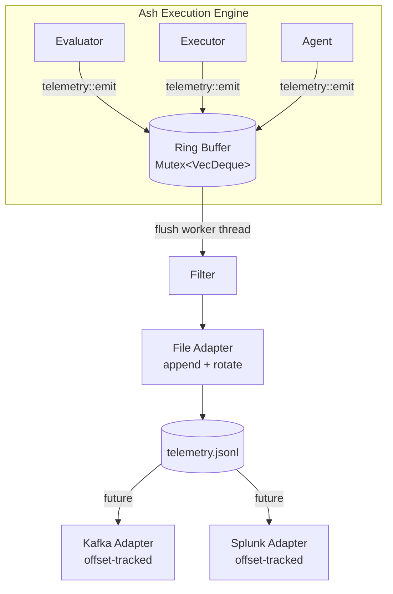

# Telemetry

## Original Requirements

we need support collecting of ash execution information,

First we need an abstracted data pipe to receive telemetry information.

Then whin application logic we need collect (feed into the data pipe) as much details as possible during execution, most importantly following aspects need be covered
- agent call request and output. meta information like what agent, model was used, execution time
- all os command execution details
- execution host name and user

data pipe should be configured ,with filter options
and log to local file could be one of the pipe options, that we can use it to replace current logging

We also need model the correlations bewteen steps and it's parent,  For example if a request is fired to run tasks of of directory , we need model the telemetric data properly so that we can re-assemble the execution detail of the that perticular execution to tell who has initiated the execution, and what happened for each step .

the telemetry logic need have it's own mod folder, while the reporting of data need be placed in key places during ash execution.

the target of telementry data need be adapter based, that we will need support things like kafka, splunk, grafana,  or a local file/db (logging),

we also need consider use local buffer/queue to decouple from target system's outages

---

## High-Level Design (v2)

### Architecture



### Key Design Principles

1. **Ring buffer stays** — Existing `Mutex<VecDeque>` is the fast path. `emit()` is an O(1) push — never blocks the caller.

2. **Async flush worker** — A background `std::thread` periodically drains the ring buffer, applies the file adapter's filter, and appends to a JSON Lines file. No explicit `flush()` needed from calling code.

3. **File is the persisted buffer** — The JSON Lines file is the durable fallback. If the process crashes between flushes, at most one flush interval worth of events is lost. Remote adapters (future) consume from this file using byte-offset tracking.

4. **Per-adapter filter** — Each adapter has its own `filter` rules string. The file adapter's filter controls what hits disk. Future remote adapters apply their own filter when reading from the file.

5. **Minimal structural change** — The ring buffer, adapter trait, and file adapter already exist. The main additions are: async flush worker, filter rules parser, and `capture_payload()` flag.

### Data Flow

```
emit(event)
  → push to ring buffer                                // O(1), never blocks

[background flush worker, every N ms]:
  → drain ring buffer
  → for each event:
      if file_filter.accepts(event):
        append JSON line to telemetry.jsonl
        if file size > max_size_mb: rotate

[future — remote adapters, separate threads]:
  loop:
    read telemetry.jsonl from adapter.offset
    if adapter_filter.accepts(line):
      batch it
    if batch full or timer:
      deliver, persist offset
```

### Config Structure

No top-level `enabled` or `filter`. Each adapter owns its own:

```yaml
telemetry:
  file:
    path: /var/log/ash/telemetry.jsonl
    max_size_mb: 100
    max_files: 7
    filter: "payload:true"
  kafka:
    enabled: false
    filter: "agent=opencode,model!=deepseek"
    brokers: ["localhost:9092"]
    topic: ash-telemetry
```

The `file` block is the only mandatory part — if present, telemetry is active and the flush worker runs.

### Filter Rules

Single comma-separated string per adapter:

```
"topic=agent*,agent!=echo,model!=deepseek,payload:true"
```

| Token | Meaning |
|---|---|
| `topic=pattern` | Include — only matching event kinds pass |
| `topic!=pattern` | Exclude — matching event kinds blocked |
| `agent=pattern` | Include — only matching agent names pass |
| `agent!=pattern` | Exclude — matching agent names blocked |
| `model=pattern` | Include — only matching model names pass |
| `model!=pattern` | Exclude — matching model names blocked |
| `payload:true` | Capture full request/response text |
| `payload:false` | Metadata only (default) |

`*` is a wildcard (internally `.*` regex). Multiple tokens are AND-ed. Empty string = pass all.

### Module Structure

```
src/telemetry/
├── mod.rs               # Public API: emit(), capture_payload() (no explicit flush)
├── event.rs             # TelemetryEvent, EventKind, severity
├── context.rs           # SpanContext
├── filter.rs            # Rules parser + regex matcher
├── config.rs            # Config structs (per-adapter)
├── pipeline.rs          # Ring buffer + flush worker thread
├── adapter.rs           # TelemetryAdapter trait
└── adapters/
    ├── mod.rs
    └── file.rs          # FileAdapter: append, rotate, retention
```

No new files beyond what already exists. The `Pipeline` struct grows a flush worker thread. The `Filter` gets a rules parser.

### Comparison to current code

| Component | Current | After |
|---|---|---|
| `Ring buffer` | `Mutex<VecDeque>` in Pipeline | Same, owned by flush worker |
| `Filter` | Literal string equality | Regex-based rules string |
| `Flush` | Explicit `flush()` call in `eval_script()` | Background thread, no caller involvement |
| `FileAdapter` | Writes on `write_batch()` | Same, called from flush worker |
| `capture_payload` | None | `AtomicBool`, exposed via `telemetry::capture_payload()` |
| `Config` | `TelemetryConfig` at top level | Per-adapter `enabled` + `filter` |

### Implementation Order

| Step | What | Files changed |
|---|---|---|
| 1 | Update config to per-adapter model, drop `min_level` | `config.rs` |
| 2 | Rewrite filter to parse rules string with regex | `filter.rs` |
| 3 | Add flush worker thread to Pipeline | `pipeline.rs` |
| 4 | Expose `capture_payload()`, remove manual `flush()` | `mod.rs` |
| 5 | Update collection points for `capture_payload()` | `eval/agent.rs`, `eval/mod.rs` |
| 6 | Update config.rs in engine/discovery | `config.rs` (top-level), `discovery.rs` |

### Testing Strategy

- **Filter**: Parse rules, assert events accepted/rejected by topic, agent, model.
- **Pipeline**: Start pipeline with flush worker, emit events, wait for flush, read file back.
- **Integration**: `test_all.ash` with telemetry enabled, validate JSON Lines output.
